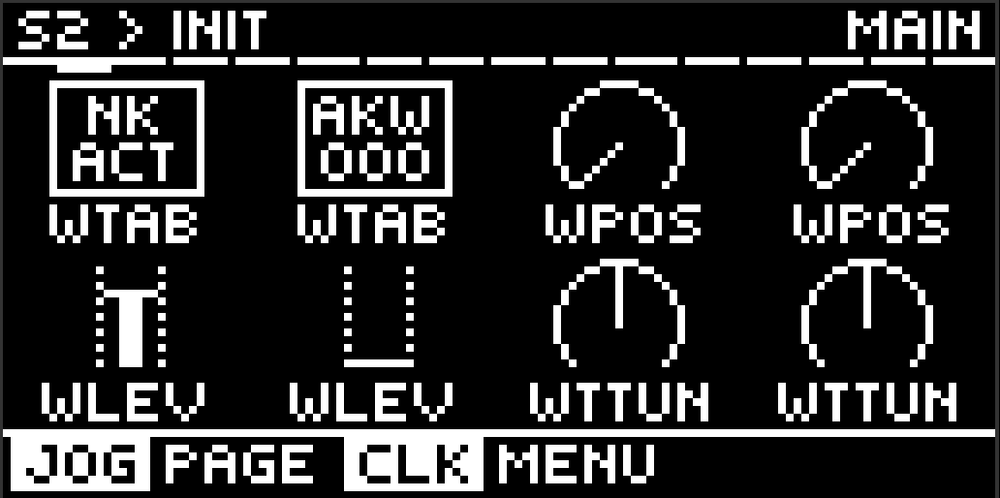
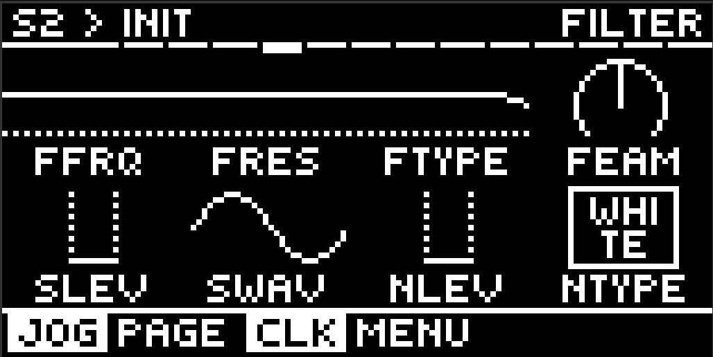
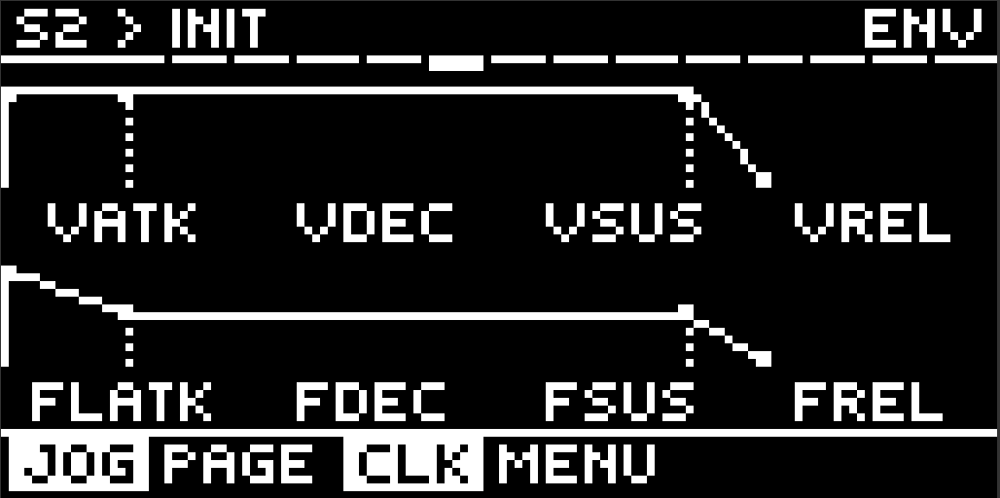
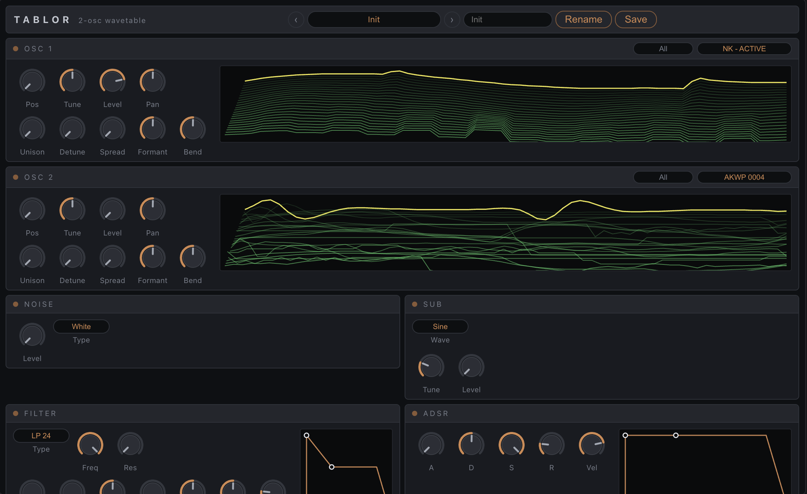

# Tablor

**A super-simple 2-oscillator wavetable synth for [Schwung](https://github.com/charlesvestal/schwung) on the Ableton Move.**

Tablor is built around one idea: switching wavetables should be the fastest,
most fun thing on the box. The first two knobs on the first page ARE the two
wavetables — turn one and the sound changes under your fingers. Everything
else stays out of the way.



8 pages, 49 controls, no menus inside menus. The graphics are Schwung's own
— declared, not drawn by us — so the filter curve and both envelopes are the
real values:

| Filter | Envelopes |
|---|---|
|  |  |

## Features

- **2 wavetable oscillators** with position morphing, bend (phase distortion),
  formant shift, and up to 4-voice unison with detune + stereo spread
- **Sub oscillator** (sine / triangle / saw / square / pulse) and **noise**
  (white / pink)
- **Multimode filter** — LP / HP / BP / Notch, 12 or 24 dB/oct, with its own
  ADSR and key/velocity tracking
- **Two envelopes** (amp + filter) with key and velocity tracking. For
  movement, point one of Schwung's own slot LFOs at any Tablor knob — that
  is what the host already does well, and it saves four pages of surface
- **8 voices** polyphonic, or mono with glide/legato
- **8 factory presets** plus **unlimited user presets** — plain `.tblr` files
  in `UserLibrary/Tablor Presets/`, name-as-filename, copy/share them freely;
  save + name entirely from the hardware
- A seeded library of **115 wavetables**
- **Web panel** — full control surface in the browser at
  `move.local:7700/remote-ui`

## Wavetables

All tables live in one folder on the Move:

```
/data/UserData/UserLibrary/Wavetables/
```

Drop wavetables there with Move Manager or the Schwung manager's file browser
— **Serum, Vital and Ableton exports all work**. `.wav` frame size is read
from the Serum `clm` chunk when present and inferred otherwise; Ableton's
FLAC-compressed `.wtNNNN` names its frame size in the extension. Factory packs
are seeded on first run:

- **Adventure Kid** (AKWF/AKWP) — 65 tables, public domain, by Kristoffer
  Ekstrand
- **Neu KatalYst** — 50 tables, free ("use them in all your synths")

On the device, the two wavetables live on knobs 1 and 2 of the main page.
Turn a knob to step through the library and hear each table as you land on
it; hold and click to open a full-screen scrolling picker when you want to
jump somewhere specific.

The file browser and the pack filter are in the **web panel** rather than on
the Move. Both used a control a knob cannot turn, so each one cost a whole
page on a four-cell screen — and the browser's graphic was Schwung's stock
`sample` shape, which is a fixed drawing that never reads the file, so it
told you nothing about the table you had loaded. The parameters still exist
and still save with the patch; they simply have no cell on the hardware.

## Web panel

Open `move.local:7700/remote-ui` and Tablor lays itself out the way the plugin
it came from does: both oscillators across the top with their wavetable
displays, then noise, sub, filter and the amp envelope, with global below. Every control is live in both
directions — turn a knob here and the Move follows, turn one on the Move and
this follows.



The waterfall is your actual wavetable, not a stand-in. The module publishes a
digest of the table it has loaded, and the panel also reads the file itself
over the manager's file API and decodes it, so the drawing follows whichever
table is loaded — changed from the browser here, or from the pot on the Move.
The bright line is the frame the Pos knob is sitting on. The ADSR curves are
computed from the live parameter values, so they are readouts rather than
decoration.

Each oscillator's title bar carries the wavetable picker and a pack filter,
which is where the file browsing lives now that it is off the hardware pages.

## Building

Cross-compiles for the Move (aarch64, glibc 2.35) in Docker:

```bash
./scripts/docker-build.sh        # inside ubuntu:22.04 with the aarch64 toolchain
```

`scripts/build.sh` is a convenience wrapper that builds on a remote host and
is specific to the author's setup. The build runs the native DSP test suite
and a config contract check; a red test fails the build. `tools/gen_params.py`
is the single source of truth for the whole parameter surface — module.json,
Movy config, the on-device editor and the web panel are all generated from it.

## Credits & licenses

Tablor is a from-scratch Schwung port of **[Wavetable](https://github.com/FigBug/Wavetable)**
by **Roland Rabien (FigBug)** — the sound engine (wavetable oscillators,
band-limited mip tables, analog-style envelopes, filter behavior) is
ported from Wavetable and its DSP library **[gin](https://github.com/FigBug/Gin)**,
both BSD-3-Clause. The JUCE dependency was removed entirely; the DSP was
re-implemented as plain C++ against Schwung's plugin API, validated against
the original's behavior with numeric golden tests.

| Component | Origin | License |
|---|---|---|
| Synth architecture & DSP | [Wavetable](https://github.com/FigBug/Wavetable) / [gin](https://github.com/FigBug/Gin) by Roland Rabien | BSD-3-Clause |
| Filter core (SVF, MZTi) | AudioFilter by Michael Massberg (via gin) | BSD-3-Clause |
| FLAC decoding | [dr_flac](https://github.com/mackron/dr_libs) by David Reid | Public domain / MIT-0 |
| Pink noise | Voss-McCartney impl. by Thomas Merchant (via gin) | MIT |
| Adventure Kid wavetables | Kristoffer Ekstrand | Public domain |
| Neu KatalYst wavetables | Neu KatalYst | Free to use |
| Host framework | [Schwung](https://github.com/charlesvestal/schwung) by Charles Vestal | — |
| Knob-page UI concepts | [Movy](https://github.com/DimaDake/schwung-movy) by megadake | MIT |
| Schwung port | [athousanddetails](https://github.com/athousanddetails) | BSD-3-Clause |

This module is **not** affiliated with Ableton. "Move" is a trademark of
Ableton AG.

## License

BSD-3-Clause — see [LICENSE](LICENSE). Factory wavetable packs keep their own
licenses as noted above.
